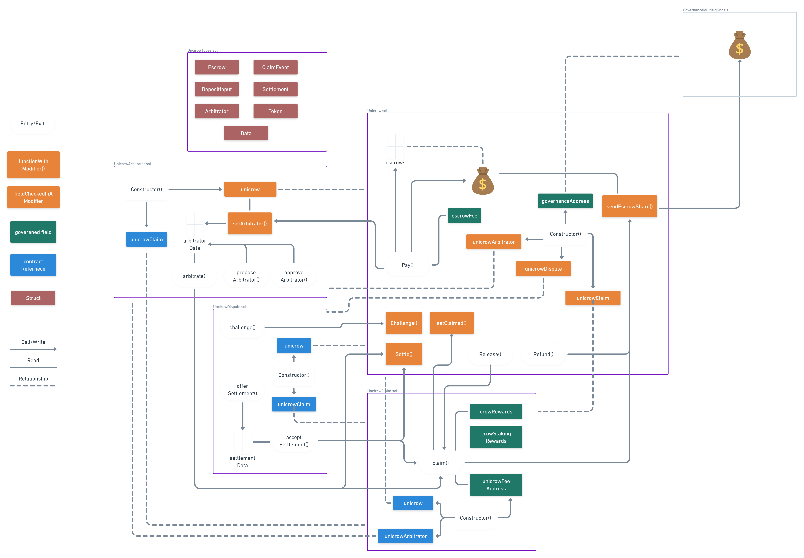

# Unicrow Contracts and Interfaces

The map below might be useful to get quick bearings



# Basic Setup and Types

To install the packages:

```bash
yarn install
```

To generate the types and compile the contracts with the new ABI:

```bash
yarn hardhat compile
```

To get local rpc accounts:

```bash
yarn hardhat accounts
```

## Setup RPC Locally

Run ganache server to run a local RPC:

```bash
yarn hardhat node
```

## Deploy the Contracts

Setup environment variables:
```bash
cp .env.example .env
```

| KEY                 | VALUE                                            |
|---------------------|--------------------------------------------------|
| GNOSIS_SAFE_ADDRESS | Governance address multisig                      |
| PRIVATE_KEY         | Deployer account                                 |
| NODE_URL            | Infura, Alchemy or any node to deploy to mainnet |

Deploy the Unicrow contracts with your local rpc:

```bash
yarn deploy:crow
```

## Interact using a console

It is recommended running the tests (see below) to test interactions with the contracts, but it is possible to do it using the console too by running a console instance first and then attaching an address.

Open the console:

```bash
yarn hardhat console --network development
```

Initiate the contract

```bash
let unicrow = ethers.getContractFactory("Unicrow") // Replace "Unicrow" for a name of any other contract
unicrow = await unicrow.attach("address_of_the_contract_here"); // address you got during the deployment
```

Call the contract functions

```bash
await unicrow.pay({ paramters }) 
```

## Tests

Run the tests locally:

```bash
yarn hardhat test --network localhost
```
